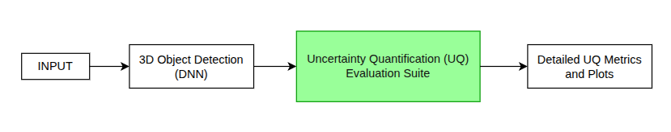

# Uncertainty Quantification Evaluation Suite for 3D Object Detection

This repository contains the description and implementation of an open-source evaluation suite for Uncertainty Quantification (UQ) in 3D Object Detection systems. The goal of this project is to provide a comprehensive and unified framework to benchmark and compare different UQ approaches for 3D Object Detection models. This evaluation suite is designed to support nuScenes dataset and includes several metrics for assessing the uncertainty of 3D Object Detection models.

## Project Description

In automated driving systems, accurate perception is crucial for ensuring safety and performance. One key aspect of perception is understanding the uncertainty of predictions made by models, especially in complex tasks like 3D object detection. UQ methods allow us to assess the reliability of these predictions, which can be critical for downstream tasks like Multi-Object Tracking (MOT) and trajectory planning. Additionally, high-uncertainty data samples can be flagged for further investigation or retraining.

While many UQ approaches exist, there is a lack of standardized evaluation indicators, making it difficult to compare and benchmark these approaches effectively. This project aims to bridge this gap by designing and developing an Uncertainty Quantification Evaluation Suite for 3D Object Detection, specifically for Oriented Bounding Boxes (OBBs).

The suite will include several UQ metrics and provide a platform for developers to benchmark their models on publicly available datasets. The implementation will focus on the following key metrics:

- **Expected Calibration Error (ECE)**
- **Maximum Calibration Error (MCE)**
- **Negative Log-Likelihood (NLL)**
- **Brier Score**
- **Mahalanobis Distance**
- **Energy Score**
- **Uncertainty Realism Metric**
- **Uncertainty Plots**

## Features

- **Literature Review**: A comprehensive review of existing research on Uncertainty Quantification in 3D Object Detection and calibration methods.
- **Metric Implementation**: Implement and integrate several key UQ metrics for 3D Object Detection, including:
  - Expected Calibration Error (ECE)
  - Maximum Calibration Error (MCE)
  - Negative Log-Likelihood (NLL)
  - Brier Score
  - Mahalanobis Distance
  - Energy Score
  - Uncertainty Realism Metric
  - Plots for regression and classification uncertainty performance
- **Benchmarking**: Support for benchmarking 3D Object Detection models on public datasets like nuScenes.
- **Modular Architecture**: A flexible and extensible design that allows for easy integration of new UQ metrics or datasets.
- **Metric Reports and Visualizations**: The suite generates comprehensive reports and visualizations, including plots for the performance of the UQ metrics.

## Key Benefits

- **Standardized UQ Evaluation**: Provides a unified set of evaluation metrics to benchmark different UQ approaches.
- **Improved Model Confidence**: Helps identify areas of high uncertainty in 3D Object Detection models, which can be used to improve system reliability.
- **Tool for Model Developers**: An easy-to-use tool for developers to evaluate their models and compare UQ techniques.
- **Data-Driven Training**: High-uncertainty predictions can be flagged and used as additional training data to improve the model.

## NOTE

This project was undertaken as part of my work at the Institute for Automotive Engineering, Aachen (DE). Due to a Non-Disclosure Agreement, I am unable to share specific details, data, or code related to this project. The repository provides only general information about my involvement and the skills utilized during its development.
If you would like to know any more information than already mentioned in the repository, feel free to connect with me.